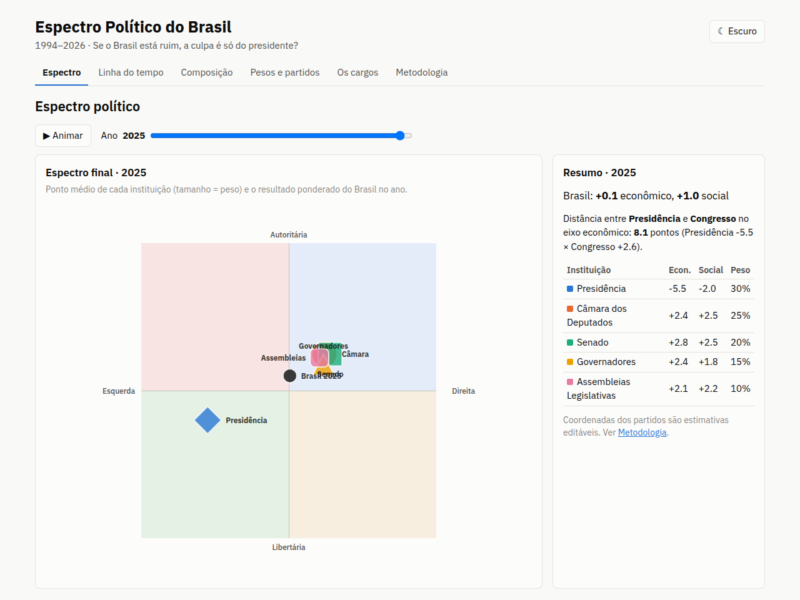

# Espectro Político do Brasil

**Onde o Brasil esteve no espectro político de 1994 a 2026, e quanto disso depende só do presidente?**

O app coloca cada instituição eleita do Brasil num plano político de dois eixos, ano a ano, e combina todas num único ponto para o país. A ideia nasceu de uma reclamação comum: quando as coisas vão mal, a culpa vai para o presidente. Mas o presidente é uma pessoa só. Congresso, governadores e Assembleias também são eleitos e muitas vezes ficam longe do presidente no espectro. O app coloca todos no mesmo gráfico para dar para comparar.



A interface e este README estão em português. O código está em inglês.

## O que dá para fazer

- **Espectro**: veja a posição média de cada instituição e o resultado ponderado do Brasil em qualquer ano, com um plano por cargo mostrando todos os partidos. Use *Animar* para percorrer 1994–2026.
- **Linha do tempo**: acompanhe os eixos econômico e social de cada instituição ao longo dos anos.
- **Composição**: veja a composição partidária de cada instituição, com os partidos ordenados da esquerda para a direita.
- **Pesos e partidos**: mude quanto cada instituição conta e arraste os partidos para onde *você* acha que eles ficam. As edições ficam salvas só no seu navegador.
- **Os cargos**: leia o que cada cargo pode e não pode fazer, e como ler os dois eixos.
- **Metodologia**: leia como os números são calculados, de onde vêm e quais são as limitações.

## Como funciona

1. **Duas coordenadas por partido.** Cada partido tem uma posição econômica `x` (−10 esquerda … +10 direita) e uma posição social `y` (−10 libertário … +10 autoritário), seguindo o modelo bidimensional do [espectro político](https://pt.wikipedia.org/wiki/Espectro_pol%C3%ADtico). Um partido pode ter `periods` que mudam sua posição a partir de um ano. O PSL antes e depois de 2018 é um exemplo.
2. **Cadeiras-equivalentes por ano.** Para cada ano, o ETL conta quantas cadeiras cada partido ocupou em cada instituição, **proporcional aos dias em exercício**. Um deputado que trocou de partido em julho conta metade do ano em cada partido. No ano corrente, o ETL divide pelos dias já decorridos, não por 365.
3. **Posição da instituição.** Média das coordenadas dos partidos, ponderada pelas cadeiras-equivalentes. Cadeiras de partidos sem coordenada, como `NO_PARTY` (sem partido), ficam de fora.
4. **Posição do Brasil.** Média das cinco instituições, ponderada por pesos que o usuário pode editar. O padrão é Presidência 30, Câmara 25, Senado 20, Governadores 15 e Assembleias Legislativas 10. Quando uma instituição não tem dados num ano, o app a deixa de fora e renormaliza os pesos restantes.

O ETL (Python) transforma os downloads brutos em dois arquivos JSON pequenos. O app (Svelte) faz toda a ponderação no navegador, então mudar um peso ou arrastar um partido atualiza todos os gráficos na hora.

## Fontes dos dados

| Instituição | Fonte | O que é usado |
|---|---|---|
| Câmara dos Deputados | [API de Dados Abertos da Câmara v2](https://dadosabertos.camara.leg.br/swagger/api.html) | `GET /deputados?idLegislatura={49..57}` para os membros de cada legislatura, e `GET /deputados/{id}/historico` para o histórico de posse, afastamento e troca de partido de cada deputado |
| Senado | [API de Dados Abertos do Senado Federal](https://legis.senado.leg.br/dadosabertos/docs/) | `senador/lista/legislatura/{n}`, `senador/{id}/mandatos` (exercícios) e `senador/{id}/filiacoes` (filiações partidárias com datas) |
| Governadores e deputados estaduais | [Portal de Dados Abertos do TSE](https://dadosabertos.tse.jus.br/) | `consulta_cand_{ano}.zip` (candidatos), 1994–2022: governadores eleitos (incluindo eleições suplementares) e deputados estaduais e distritais |
| Presidência | [`data/presidents.yaml`](data/presidents.yaml) | Lista curada à mão, incluindo os períodos em que o presidente ficou sem partido |
| Coordenadas dos partidos | [`data/parties.yaml`](data/parties.yaml) | **Estimativas**, não medições. O eixo econômico pode ser calibrado com o survey de especialistas de Bolognesi, Ribeiro & Codato (2023). O eixo social não tem fonte acadêmica equivalente |

O [`data/aliases.yaml`](data/aliases.yaml) mapeia as siglas cruas de cada fonte para um id canônico, para que renomeações como PMDB → MDB e PFL → DEM contem como o mesmo partido. Fusões não reescrevem o passado: um deputado do PFL em 2005 continua contando como PFL/DEM, não como União Brasil.

Todos os dados brutos vêm de serviços públicos de dados abertos do governo brasileiro. Os downloads brutos (cerca de 60 MB) não estão no repositório. O JSON gerado em `web/public/data/` está versionado, então dá para rodar o app sem rodar o ETL.

## Limitações

- **As coordenadas são estimativas.** Não existe classificação oficial dos partidos brasileiros, e a sua pode ser diferente da nossa. Por isso todo partido pode ser arrastado no app.
- O partido é usado como aproximação da posição de cada político. Políticos muitas vezes divergem do próprio partido.
- **Câmara antes de 2003**: a API não traz datas confiáveis de troca de partido, então cada deputado conta com o partido registrado na legislatura.
- **Senado em 1994**: os mandatos iniciados em 1987 não têm exercícios nem datas de filiação na API. O ETL conta o titular pelo mandato inteiro, com a filiação mais recente registrada.
- **Governadores e deputados estaduais**: cada um conta com o partido pelo qual foi eleito, pelo mandato inteiro. Trocas de partido não são capturadas, nem vices que assumiram por renúncia ou morte. Eleições suplementares, como AM 2017 e TO 2018, são capturadas.
- **Governadores e Assembleias em 1994**: sem dados. Os mandatos vigentes vieram da eleição de 1990, antes do recorte.
- Posição ideológica não mede competência nem resultado de governo.

## Como rodar

### Estrutura do projeto

```
data/
  aliases.yaml        sigla crua do partido -> id canônico
  parties.yaml        coordenadas dos partidos (x econômico, y social), com mudanças por período
  presidents.yaml     presidentes e seus partidos, curados à mão
  raw/                downloads (ignorados pelo git)
etl/
  fetch_chamber.py    API da Câmara -> data/raw/chamber/
  fetch_senate.py     API do Senado -> data/raw/senate/
  tse.py              lê os ZIPs do TSE em data/raw/tse/
  build.py            gera web/public/data/{composition,parties}.json
  test_build.py       checagens de sanidade: total de cadeiras por instituição e ano
web/
  public/data/        JSON gerado (versionado)
  src/lib/            cálculo, estado, gráficos
  src/views/          um componente por aba
```

### App web

Requer Node.js 20.19+ ou 22.12+ (Vite 8).

```sh
cd web
npm ci
npm run dev      # http://localhost:5173
npm test         # testes unitários da ponderação (Vitest)
npm run build    # site estático em web/dist/
```

O build é um site estático que carrega `data/*.json` por caminho relativo, então funciona em qualquer hospedagem estática, inclusive num subcaminho como o GitHub Pages.

Stack: [Svelte 5](https://svelte.dev/), [Vite](https://vite.dev/), [Tailwind CSS 4](https://tailwindcss.com/) e [Apache ECharts](https://echarts.apache.org/).

### Regerando os dados

Requer Python 3.11+. Rode a partir da raiz do repositório:

```sh
python3 -m venv .venv
.venv/bin/pip install -r etl/requirements.txt

.venv/bin/python etl/fetch_chamber.py   # listas de membros + um arquivo de histórico por deputado
.venv/bin/python etl/fetch_senate.py    # listas de membros + mandatos e filiações por senador
```

Os scripts de download pulam deputados e senadores já baixados. Para atualizar um deles, apague o arquivo antes.

O TSE bloqueia downloads automatizados, então baixe os arquivos do TSE à mão. Pegue o `consulta_cand_{ano}.zip` de 1994, 1998, 2002, 2006, 2010, 2014, 2018 e 2022 no portal de dados abertos do TSE (conjunto *Candidatos*) e salve em `data/raw/tse/`. Depois rode:

```sh
.venv/bin/python etl/build.py     # grava web/public/data/*.json e imprime os totais de cadeiras
.venv/bin/python -m pytest etl    # confere ~513 deputados, ~81 senadores, 27 governadores e ~1.059 deputados estaduais por ano
```

Para mudar coordenadas, aliases ou presidentes, edite os YAML em `data/` e rode o `build.py` de novo.

## Licença

O código está sob a [Licença MIT](LICENSE). Os dados vêm dos serviços públicos de dados abertos da Câmara dos Deputados, do Senado Federal e do Tribunal Superior Eleitoral (TSE).
